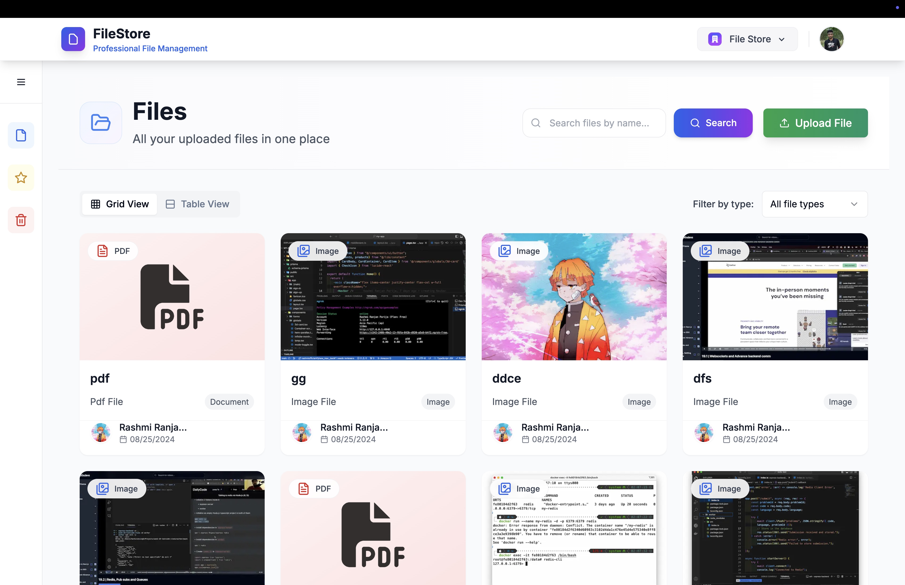
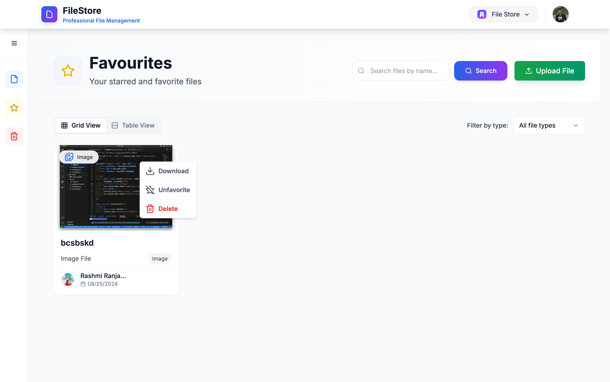
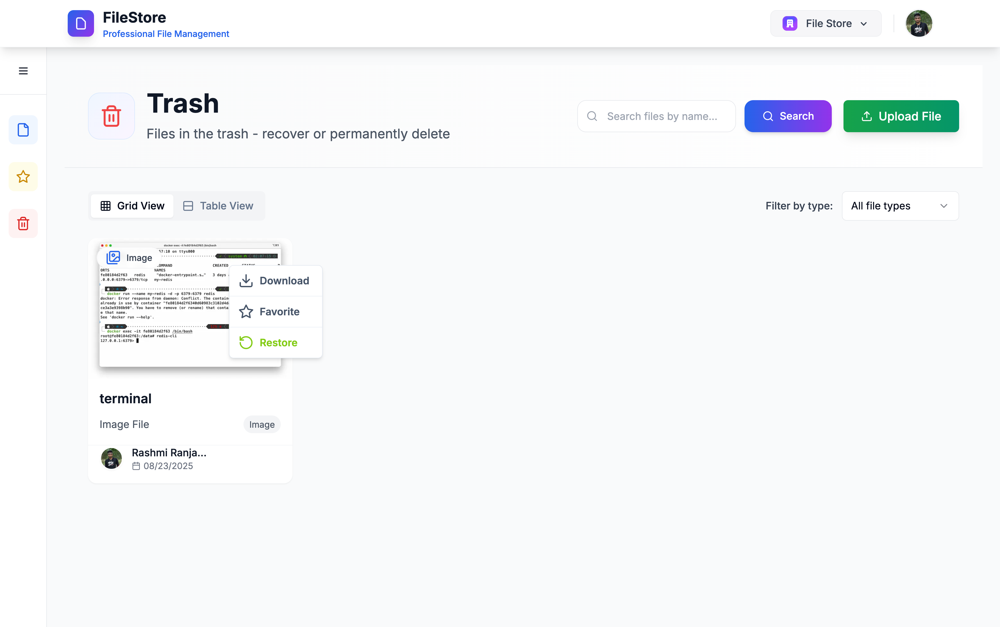

# 🗂️ File Store App (Next.js + Convex + Clerk)

A real-time, multi-tenant file storage platform built with **Next.js**, **Convex**, and **Clerk**. Authenticated users can securely upload, access, organize, and share files within their organization with support for RBAC, favorites, search, trash recovery, and more.

> ✅ Supports real-time syncing
> ✅ Role-based access via Clerk
> ✅ Secure file uploads via Convex Blob Storage
> ✅ Scheduled deletion via Convex Cron Jobs

---

## 📸 Demo Screenshots

### 🔐 Authentication (Clerk)


### 📁 File Dashboard


### ⭐ Favorites & Filters


### 🗑️ Trash & Restore


---
## 🖥️ Tech Stack

- ⚡ **Next.js** (App Router)
- 🧠 **Convex** (Serverless backend + DB + Realtime sync)
- 🔐 **Clerk** (Authentication and organization management)
- 🗄️ **Convex Blob Storage** (File uploads)
- 🛠️ **TypeScript** + Modular Convex Functions (mutations, queries, actions, schema)

---

## 📦 Features

- ✅ Multi-tenant organization support
- 🔐 Auth with Clerk (Sign in, Sign up, Org invite, RBAC)
- 📁 File upload using Convex storage with secure upload URLs
- 🔄 Real-time sync across sessions using Convex subscriptions
- 🌙 Trash + Restore + Auto-delete (via Cron)
- ⭐ Favorite/unfavorite files
- 🔎 Search and filter by file type
- 🧰 Clean modular codebase (Convex: mutations, queries, internalMutations, cron, http)

---

## 🛠️ Local Setup Instructions

> This project requires **Node.js ≥ 18**, and uses **Convex CLI** + **Clerk**.

---

### 1️⃣ Clone the Repo

```bash
git clone https://github.com/rashmiofficial45/file-storage-app.git
cd file-store-app
```

### 2️⃣ Install Dependencies
Option A: Using pnpm
```bash
pnpm install
```
Option B: Using npm
```bash
npm install
```

### 3️⃣ Set Up Environment Variables
Create a .env.local file in the root and add the following:

```bash
NEXT_PUBLIC_CLERK_PUBLISHABLE_KEY=pk_test_XXXXXXX
NEXT_PUBLIC_CONVEX_URL=https://<your-convex-deployment>.convex.cloud
CLERK_SECRET_KEY=sk_test_XXXXXXX
CLERK_WEBHOOK_SECRET=whsec_XXXXXXX
CLERK_HOSTNAME=your-app.clerk.accounts.dev
📝 You can get these keys from your Clerk dashboard and Convex dashboard.
```

### 4️⃣ Link Convex Project
If not linked:
```bash
npx convex init
## Follow the CLI to log in and link to your Convex project.
```

### 5️⃣ Push Convex Schema
This will sync your schema to Convex:
```bash
npx convex push
```

### 6️⃣ Start the Dev Server
For pnpm:
```bash
pnpm dev
```
For npm:
```bash
npm run dev
```

### 🔁 Webhooks Setup (Clerk → Convex)
In your Clerk dashboard, go to Webhooks.

Set the destination URL to:
```bash

https://<your-app-url>/api/clerk
```
Add events:
```bash
user.created
user.updated
organizationMembership.created
organizationMembership.updated
```

📁 Folder Structure
```bash
file-store-app/
│
├── convex/
│   ├── auth.config.ts
│   ├── schema.ts              # Convex DB schema
│   ├── files.ts               # File queries and mutations
│   ├── users.ts               # User & org syncing
│   ├── clerk.ts               # Webhook verification
│   ├── cron.ts                # Scheduled deletions
│   ├── http.ts                # HTTP router for Clerk webhooks
│   └── _generated/            # Auto-generated Convex types
│
├── app/                       # Next.js routes
├── components/                # Reusable UI
├── lib/                       # Clerk/Auth utils
├── .env.local                 # Environment variables
├── README.md
└── package.json
```
